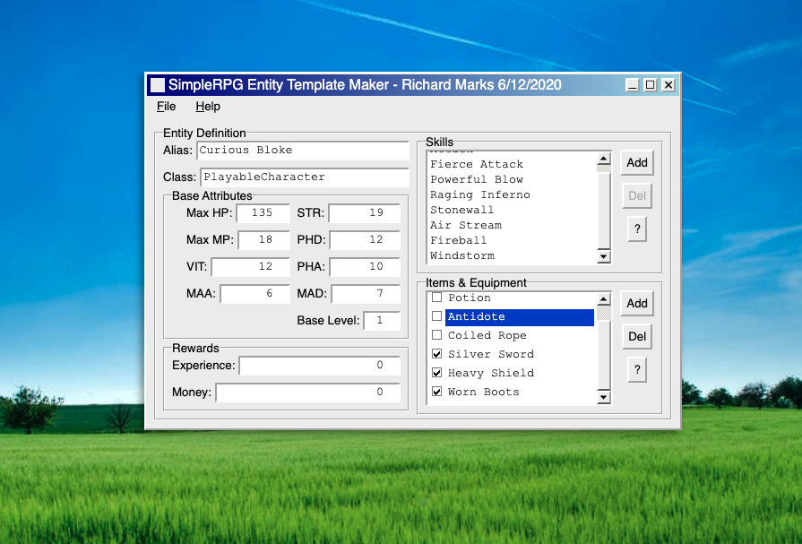

# SimpleRPG Entity Template Maker

This project started as a personal challenge to rewrite an old Visual Basic 6 application that I had written in 2007 for defining SimpleRPG entity templates.

> SimpleRPG was the _codename_ for an RPG game engine that I developed in 2007 which became extended and revamped into a full game a few months later.

## Features
+ Fully-functional tool for defining SimpleRPG entity templates
+ HTML + CSS + Vanilla JavaScript Web Application
+ Visually styled to mimic original VB6 version
+ InputBox and MsgBox implementations
+ ListBox and Checked ListBox implementations
+ Custom Cascading Main Menu
+ Automatic DOM UI and Application State Sync
+ Export to file
+ No third party libraries
+ Developed in under 48 hours

## Usage

Use any local web server and serve the index.html file in the public directory.

## License
MIT License (c) 2020, Richard Marks
See LICENSE.md for details
